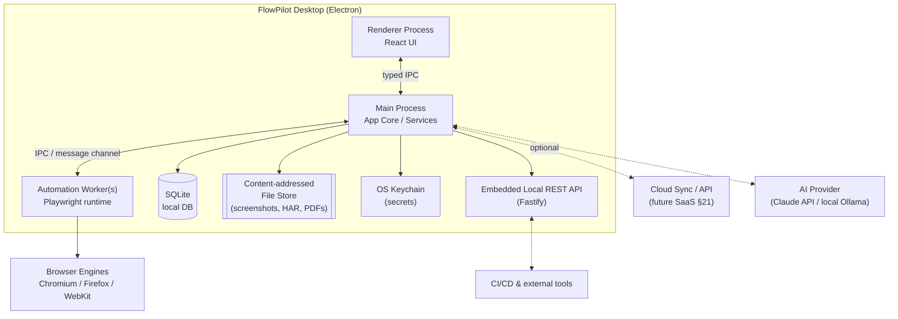
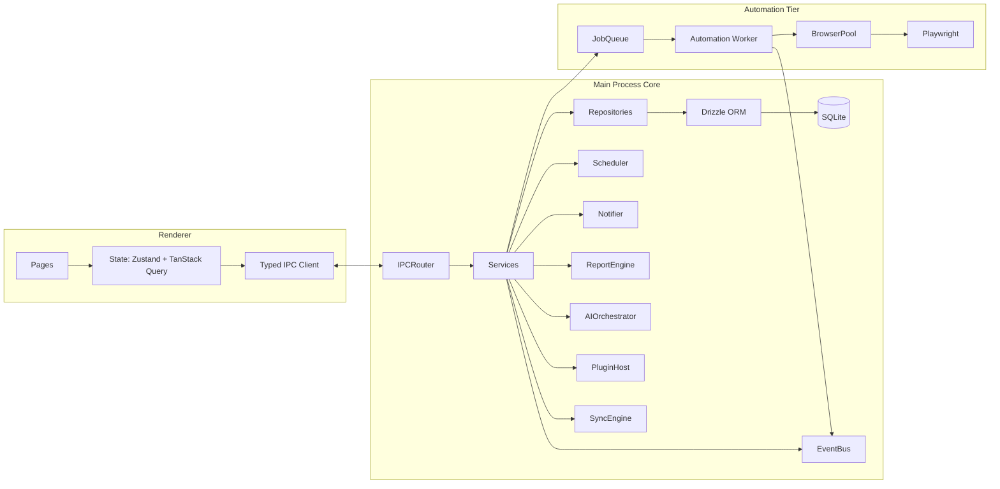
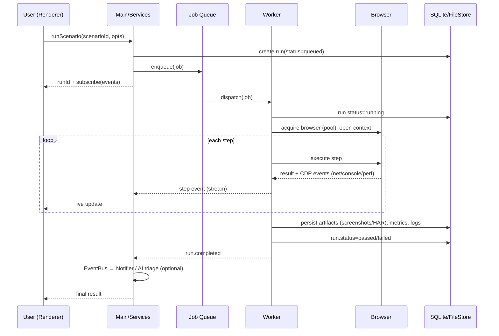
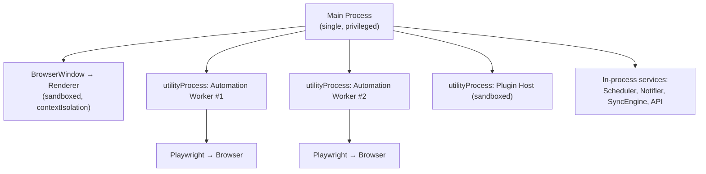
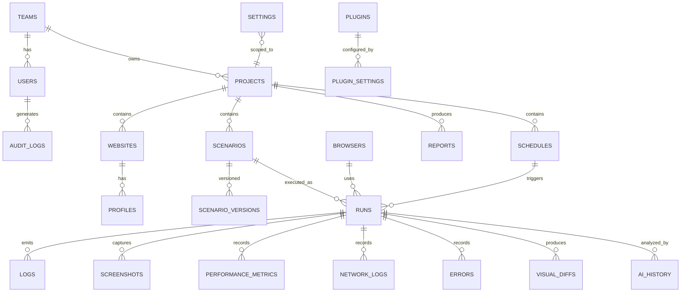
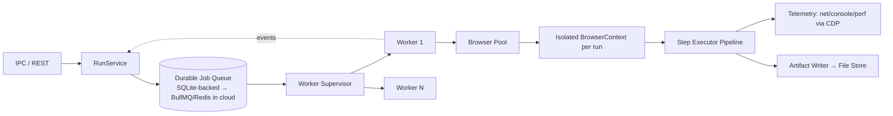
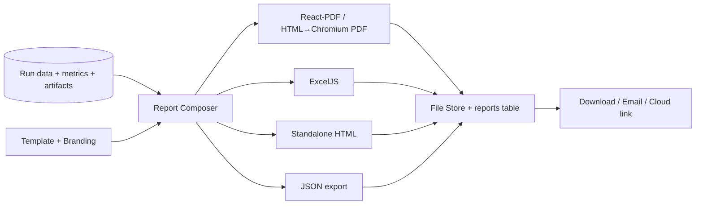
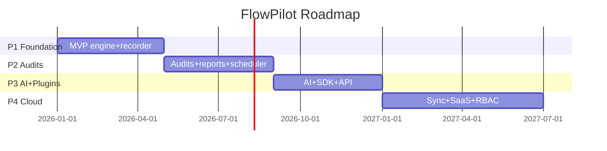

# Enterprise Browser Automation & Website Testing Platform

## Production-Grade Technical Blueprint

**Codename:** `FlowPilot` — a modular desktop automation & website-testing platform, architected to evolve into a commercial desktop product and a future multi-tenant SaaS.

**Document status:** v1.0 — Foundational Architecture & Delivery Blueprint
**Audience:** Engineering leadership, platform engineers, QA automation, DevOps, product, and prospective investors/CTO reviewers.
**Prepared under the combined lens of:** Principal Software Architect · Desktop App Engineer · SaaS Architect · Product Manager · QA Automation Expert · Browser Automation Engineer · UX Designer · DevOps Architect · Database Architect · Performance Engineer · Security Engineer · Technical CTO.

> **How to read this document.** Sections 1–2 are product/strategy. Sections 3–16 are the buildable technical core (an engineer can start coding from these). Sections 17–20 are delivery. Sections 21–23 are the forward-looking SaaS path, risk register, and executive CTO review. Every major technology choice carries an explicit *why* and, where relevant, the alternative we rejected and the reason.

---

# 1 · Product Vision

## 1.1 Product Purpose

FlowPilot is a **desktop-first browser automation and website quality platform** that unifies capabilities today scattered across five or six separate tools: end-to-end test automation (Playwright/Cypress), synthetic monitoring, Lighthouse-style auditing, visual regression (Percy/Applitools), broken-link/SEO crawling (Screaming Frog), and cross-browser screenshotting (BrowserStack). It targets teams that want **local-first execution** (data never leaves the machine unless they opt in), **record-and-replay authoring** for non-engineers, and **AI-assisted analysis** that turns raw signals (console errors, slow requests, failed assertions) into prioritized, human-readable findings.

The core thesis: *website quality work is fragmented, expensive, and cloud-locked.* A single, extensible desktop app — with a clear path to team cloud sync — can consolidate the workflow, cut per-seat cost, and keep sensitive test data (credentials, internal URLs, PII in staging) on-device by default.

## 1.2 Target Audience

| Segment | Who | Primary jobs-to-be-done |
|---|---|---|
| **Solo / freelance QA** | Contract testers, indie devs | Record flows, run audits per client, export branded PDF reports |
| **SMB engineering teams** | 5–50 dev orgs without a dedicated SRE | CI-adjacent regression, scheduled uptime + performance checks |
| **Agencies** | Web/marketing agencies managing many client sites | Multi-project SEO/accessibility audits, white-label reports |
| **Enterprise QA/Platform** | Regulated orgs, security-sensitive | On-prem execution, RBAC, audit trails, SSO, private plugin registry |
| **Growth/SEO/Marketing ops** | Non-engineers | Visual, no-code scenario building, scheduled crawls, alerts |

Primary wedge: **agencies and SMB QA teams** — they feel the tool-sprawl pain acutely and value white-label reporting and local data control.

## 1.3 Unique Selling Proposition (USP)

1. **Local-first, cloud-optional.** Full functionality offline; cloud sync is an additive convenience, not a requirement. This is a hard differentiator vs. BrowserStack/Percy (cloud-mandatory).
2. **One tool, six jobs.** Automation + audit + performance + visual regression + crawler + reporting in a single license.
3. **Record-to-robust-test.** A recorder that emits *stable, editable, versioned* scenarios (semantic selectors + self-healing), not brittle coordinate scripts.
4. **AI as an analyst, not a gimmick.** LLM layer triages failures, clusters errors, drafts fixes, and summarizes reports — with a local-model fallback for privacy.
5. **Extensible by design.** A sandboxed plugin SDK lets teams add custom audits, exporters, and browser targets without forking.

## 1.4 Competitor Comparison

| Capability | **FlowPilot** | Playwright/Cypress | BrowserStack | Percy/Applitools | Screaming Frog | Postman |
|---|---|---|---|---|---|---|
| Local-first execution | ✅ | ✅ (code only) | ❌ | ❌ | ✅ | ⚠️ |
| No-code recorder → editable tests | ✅ | ⚠️ (codegen) | ⚠️ | ❌ | ❌ | ⚠️ |
| Performance (Core Web Vitals) | ✅ | ⚠️ (via traces) | ⚠️ | ❌ | ❌ | ❌ |
| Visual regression | ✅ | ⚠️ | ⚠️ | ✅ | ❌ | ❌ |
| SEO / broken-link crawl | ✅ | ❌ | ❌ | ❌ | ✅ | ❌ |
| Accessibility audit (axe) | ✅ | ⚠️ (plugin) | ⚠️ | ⚠️ | ⚠️ | ❌ |
| Branded PDF/Excel reports | ✅ | ❌ | ⚠️ | ⚠️ | ⚠️ | ⚠️ |
| Scheduling (desktop) | ✅ | ❌ | ✅ (cloud) | ✅ (cloud) | ⚠️ | ⚠️ |
| AI failure analysis | ✅ | ❌ | ⚠️ | ⚠️ | ❌ | ⚠️ |
| Plugin SDK | ✅ | ⚠️ | ❌ | ❌ | ❌ | ✅ |
| Desktop app | ✅ | ❌ | ❌ | ❌ | ✅ | ✅ |

Legend: ✅ first-class · ⚠️ partial/via workaround · ❌ absent.

**Positioning:** FlowPilot is not trying to beat Playwright as a *library* — it *embeds* Playwright and wraps it in an application layer (UI, storage, reporting, scheduling, AI) that libraries deliberately don't provide. It is not trying to be BrowserStack's device farm — it's the authoring/analysis cockpit that can *push to* such farms later.

## 1.5 Market Opportunity

- The software testing market is large and growing (test automation ~high-single-digit-billions USD, low-teens % CAGR); web performance/observability and DevEx tooling are adjacent tailwinds.
- Structural drivers: Core Web Vitals as an SEO ranking input, accessibility legislation (ADA/EAA/WCAG enforcement) creating recurring audit demand, and continued fragmentation fatigue among mid-market teams.
- Wedge economics: agencies bill audits as a service; a tool that produces white-label deliverables in minutes has direct, provable ROI, making top-down sales unnecessary at first (PLG/self-serve).

## 1.6 Monetization Model

- **Per-seat subscription** (monthly/annual) for Pro.
- **Per-workspace + per-seat** for Enterprise, with volume tiers.
- **Usage add-ons:** cloud run minutes, cloud storage for artifacts, AI credits (when using FlowPilot-hosted models).
- **Plugin marketplace** revenue share (future).
- **Support/SLA & on-prem license** for Enterprise.

## 1.7 Free vs Pro vs Enterprise

| Feature | Free | Pro | Enterprise |
|---|---|---|---|
| Projects | 3 | Unlimited | Unlimited |
| Local automation & recorder | ✅ | ✅ | ✅ |
| Browsers (Chromium/FF/WebKit) | Chromium | All | All + custom targets |
| Scheduling | Manual only | ✅ local | ✅ local + cloud triggers |
| Performance & audits | Basic | Full | Full + custom rules |
| Visual regression baselines | 10 | Unlimited (local) | Unlimited + shared |
| PDF/Excel reports | Watermarked | White-label | White-label + templates |
| AI assistant | Bring-your-own key | Included credits | Included + local model / private endpoint |
| Cloud sync | ❌ | Personal | Team workspaces |
| Team collaboration / RBAC | ❌ | ❌ | ✅ SSO/SAML, roles |
| Audit logs & compliance | ❌ | ❌ | ✅ |
| Plugin SDK | Read-only | ✅ | ✅ + private registry |
| Support | Community | Email | SLA + dedicated |

Free is a genuine, useful tool (drives PLG), gated on *scale* (project count, cloud, team) rather than crippling *capability*.

---

# 2 · Complete Feature List

Each feature is documented with **Purpose · Business Value · User Flow · Backend Flow · Future Improvements.** Backend flow references the architecture in §3 and the automation engine in §9.

## 2.1 Dashboard
- **Purpose:** Single glanceable view of project health — recent runs, pass/fail trend, open issues, scheduled jobs, and Core Web Vitals deltas.
- **Business Value:** Reduces time-to-signal; the first screen that proves value on every launch → drives retention.
- **User Flow:** Launch app → Dashboard loads last workspace → cards for *Recent Runs*, *Failing Tests*, *Vitals Trend*, *Upcoming Schedules*, *AI Insights* → click any card to drill down.
- **Backend Flow:** Renderer requests `dashboard.summary` over IPC → Main process queries SQLite via repository layer (aggregates from `runs`, `errors`, `performance_metrics`, `schedules`) → returns a memoized DTO (cached 30s) → charts render from a normalized time-series.
- **Future Improvements:** Customizable widget grid, anomaly highlighting (AI), cross-project rollups for agencies.

## 2.2 Projects
- **Purpose:** Top-level container grouping websites, scenarios, schedules, baselines, and reports.
- **Business Value:** Maps to how agencies/teams think (per-client, per-app); enables isolation and per-project billing/reporting.
- **User Flow:** Projects list → *New Project* (name, base URL, environment, tags) → project workspace with tabs (Websites, Scenarios, Runs, Reports, Settings).
- **Backend Flow:** `projects.create` → validation (zod) → repository insert → emits `project.created` on the internal event bus → seeds default settings row.
- **Future Improvements:** Project templates, import from Postman/Playwright config, per-project secrets vault.

## 2.3 Website Manager
- **Purpose:** Register target sites/environments (prod, staging, local), credentials, headers, viewport presets, and crawl scope.
- **Business Value:** Central config removes repetitive setup; environment switching is one click.
- **User Flow:** Add website → set base URL, auth (basic/cookie/token), allowed/blocked paths, default device → save.
- **Backend Flow:** Credentials routed to OS keychain (keytar/DPAPI/Keychain) — never stored plaintext in DB; DB stores a reference id. Config validated and persisted.
- **Future Improvements:** Auto-discovery via sitemap.xml, environment inheritance, health ping.

## 2.4 Browser Manager
- **Purpose:** Manage installed browser engines/versions, channels (stable/beta), and device emulation profiles.
- **Business Value:** Cross-browser confidence without a device farm; reproducible engine versions.
- **User Flow:** Browsers tab → install/verify Chromium/Firefox/WebKit → pick default → define device presets (iPhone, Pixel, custom viewport/UA/DPR).
- **Backend Flow:** Wraps Playwright's browser download/registry; version pinned per project; a `browsers` table records available binaries + checksums.
- **Future Improvements:** Remote browser targets (CDP over WebSocket), BrowserStack/LambdaTest bridge, headful debugging streaming.

## 2.5 Automation Engine (see §9 for full detail)
- **Purpose:** Execute scenarios reliably with retries, parallelism, and isolation.
- **Business Value:** The reliability core — flaky automation destroys trust; this is the moat.
- **User Flow:** Select scenario(s) → choose browser/device/env → Run → live log + step timeline → result.
- **Backend Flow:** Main enqueues a job → Automation Worker (separate process) pulls from queue → acquires browser from pool → executes steps → streams events over IPC → persists run + artifacts.
- **Future Improvements:** Distributed workers, self-healing selectors, time-travel debugging.

## 2.6 Workflow Recorder (see §10)
- **Purpose:** Capture user interactions in a real browser and emit editable, semantic scenarios.
- **Business Value:** Opens automation to non-coders; 10× faster authoring.
- **User Flow:** *Record* → browser opens instrumented → user clicks/types → each action becomes a step with a suggested robust selector → Stop → review/edit → save.
- **Backend Flow:** Injected recorder script + CDP listeners capture DOM events → normalized to a Scenario JSON (selectors ranked by stability) → stored, versioned.
- **Future Improvements:** Assertion suggestions, "record from user session" import, network stubbing capture.

## 2.7 Scenario Builder
- **Purpose:** Visual, node/step editor to compose/modify test flows without code, with a code view for power users.
- **Business Value:** Bridges no-code and pro-code; single artifact both personas edit.
- **User Flow:** Drag steps (navigate, click, fill, assert, wait, screenshot, script) → configure per-step → validate → dry-run.
- **Backend Flow:** Steps are typed nodes in Scenario JSON; validation ensures selector presence and step ordering; "code view" is a deterministic transpile to Playwright TS.
- **Future Improvements:** Reusable step groups/components, data-driven runs (CSV), conditional/loop nodes.

## 2.8 Scheduler
- **Purpose:** Run scenarios/audits on cron-like schedules with alerting.
- **Business Value:** Turns one-off tests into continuous monitoring — a recurring-value feature that justifies subscription.
- **User Flow:** Schedule tab → pick scenario(s) → cadence (cron/interval) → conditions & notifications → enable.
- **Backend Flow:** A background scheduler service (in Main) uses a persisted `schedules` table; a durable timer wakes the worker; OS-level wake (Windows Task Scheduler / launchd) handles app-closed runs (Enterprise).
- **Future Improvements:** Cloud-triggered schedules, dependency chains, quiet hours, flaky-retry policy.

## 2.9 Performance Testing (see §12)
- **Purpose:** Capture Core Web Vitals and resource-level metrics per run.
- **Business Value:** SEO + UX ROI; trend regressions catch perf debt early.
- **User Flow:** Enable perf on a run → view LCP/CLS/FCP/TTFB, waterfall, memory/CPU → compare vs baseline.
- **Backend Flow:** Playwright + CDP `Performance`/`Tracing` domains + `web-vitals` injection → metrics normalized into `performance_metrics`.
- **Future Improvements:** Lighthouse parity scoring, throttling profiles, real-user-metric ingestion (future SaaS).

## 2.10 Network Inspector
- **Purpose:** Record all requests/responses (status, timing, size, headers) per run.
- **Business Value:** Root-cause failed loads, mixed content, slow third parties.
- **User Flow:** Run detail → Network tab → filterable waterfall → click request for full detail/HAR export.
- **Backend Flow:** CDP `Network` domain events captured by worker → stored as HAR + normalized `network_logs` rows (large bodies offloaded to file store).
- **Future Improvements:** Request mocking/stubbing, third-party budget alerts, diff between runs.

## 2.11 Console Logger
- **Purpose:** Capture browser console (log/warn/error) and uncaught exceptions.
- **Business Value:** Surfaces JS errors invisible to manual QA.
- **User Flow:** Run detail → Console tab → severity filter → stack traces → jump to related network/step.
- **Backend Flow:** CDP `Runtime.consoleAPICalled` + `Runtime.exceptionThrown` → `console_logs`/`errors` tables.
- **Future Improvements:** Source-map resolution, error fingerprint clustering (AI), sourcemap upload.

## 2.12 SEO Audit
- **Purpose:** Check meta tags, headings, canonical, structured data, robots, sitemap, indexability.
- **Business Value:** Direct revenue lever for agencies; recurring audit deliverable.
- **User Flow:** Run SEO audit on a URL/site → scored checklist with severities → export.
- **Backend Flow:** A crawler visits pages, extracts DOM/head signals via evaluated scripts, runs a rules engine (pluggable), scores results.
- **Future Improvements:** Content quality/LLM checks, keyword coverage, competitor deltas.

## 2.13 Accessibility Audit
- **Purpose:** WCAG 2.1/2.2 checks via `axe-core`.
- **Business Value:** Legal-risk mitigation; growing regulatory demand.
- **User Flow:** Run a11y audit → violations grouped by impact → remediation guidance → export.
- **Backend Flow:** Inject `axe-core` into each page context → collect violations → map to WCAG criteria → persist.
- **Future Improvements:** Guided fix snippets (AI), manual-check workflow, VPAT generation.

## 2.14 Broken Link Scanner
- **Purpose:** Crawl a site and report 4xx/5xx, redirect chains, and orphan pages.
- **Business Value:** Prevents lost traffic/conversions; classic agency deliverable.
- **User Flow:** Set scope/depth/concurrency → crawl → link graph + status table → export.
- **Backend Flow:** BFS crawler with politeness (robots, rate limits) → HTTP HEAD/GET with fallback → `runs`+`network_logs`.
- **Future Improvements:** Scheduled diff crawls, external vs internal split, screenshot-on-404.

## 2.15 Screenshot Manager (see §11 for reporting tie-in)
- **Purpose:** Full-page/element/responsive screenshots across devices; organized library.
- **Business Value:** Evidence for reports, design review, visual baselines.
- **User Flow:** Capture (single/batch/responsive matrix) → gallery with tags → attach to report.
- **Backend Flow:** Worker uses Playwright `screenshot()`; images written to content-addressed file store; thumbnails generated; `screenshots` rows index metadata.
- **Future Improvements:** Scroll-stitch for lazy content, redaction masks, annotation.

## 2.16 PDF Reports (see §11)
- **Purpose:** Branded, shareable deliverables summarizing a run/audit.
- **Business Value:** The artifact clients pay for; white-labeling is a Pro upsell.
- **User Flow:** Run/audit → *Generate Report* → pick template/branding → preview → export/share.
- **Backend Flow:** Report composer builds a React-PDF (or HTML→PDF) document from run data + charts + screenshots → written to disk → optional cloud upload.
- **Future Improvements:** Scheduled emailed reports, multi-run trend reports, custom template editor.

## 2.17 Cloud Sync
- **Purpose:** Optional sync of projects, scenarios, baselines, and reports across devices/team.
- **Business Value:** Enables team tier + retention across machines.
- **User Flow:** Sign in → enable sync → conflict-aware two-way sync → shared workspace (Enterprise).
- **Backend Flow:** A sync engine diffs local SQLite against cloud (last-write-wins + vector clocks for scenarios); artifacts to object storage; see §21.
- **Future Improvements:** Real-time collaboration, selective sync, offline-first CRDT for scenario editing.

## 2.18 API
- **Purpose:** Local REST/IPC API + future cloud REST for CI integration and automation-of-automation.
- **Business Value:** Fits into CI/CD pipelines; enterprise integration surface.
- **User Flow:** Generate API token → call `POST /runs` from CI → poll/subscribe for results.
- **Backend Flow:** Embedded Fastify server (local) exposes the same service layer used by IPC; cloud API mirrors it (see §7/§21).
- **Future Improvements:** GraphQL, webhooks, SDK clients (JS/Python).

## 2.19 Plugin System (see §15)
- **Purpose:** Extend automation steps, audits, exporters, browsers, and AI providers.
- **Business Value:** Ecosystem moat; enterprise custom rules; marketplace revenue.
- **User Flow:** Plugins tab → browse/install → configure → plugin adds steps/audits/exporters.
- **Backend Flow:** Plugins run in isolated Node worker/VM with a capability-scoped API and manifest permissions.
- **Future Improvements:** Signed marketplace, private registries, hot-reload dev mode.

## 2.20 AI Assistant (see §16)
- **Purpose:** Explain failures, generate tests from prose, suggest fixes, summarize reports.
- **Business Value:** Reduces expertise barrier; premium differentiator.
- **User Flow:** "Analyze this failure" / "Write a test for checkout" → AI proposes steps/diagnosis → user accepts/edits.
- **Backend Flow:** AI orchestration service builds context (steps, logs, DOM snapshot), calls provider (Claude API default; local Ollama fallback), returns structured suggestions.
- **Future Improvements:** Agentic self-healing runs, RAG over past runs, guardrailed auto-fix PRs.

## 2.21 Visual Regression
- **Purpose:** Pixel/DOM-diff current screenshots vs approved baselines.
- **Business Value:** Catches unintended UI changes; premium feature vs Percy.
- **User Flow:** Approve baseline → future runs diff → review side-by-side → approve/reject.
- **Backend Flow:** `pixelmatch`/`odiff` compares images with anti-alias tolerance + ignore regions; diffs stored; status gates run pass/fail.
- **Future Improvements:** Layout-aware (DOM) diffing, AI "is this change meaningful?" triage, responsive matrix diff.

## 2.22 Team Collaboration
- **Purpose:** Shared workspaces, roles, comments, review workflows (Enterprise).
- **Business Value:** Moves single-seat to org-wide; expansion revenue.
- **User Flow:** Invite members → assign roles → comment on runs/reports → approval gates.
- **Backend Flow:** Cloud workspace with RBAC (see §6/§21); activity feed from audit log.
- **Future Improvements:** Real-time presence, @mentions, Slack/Teams threads.

## 2.23 Notifications
- **Purpose:** Alert on failures, regressions, schedule outcomes.
- **Business Value:** Keeps users engaged even when app is closed; drives return.
- **User Flow:** Configure channels (desktop, email, Slack, webhook) + conditions → receive alerts.
- **Backend Flow:** Event bus → notification service → channel adapters; dedupe + throttling.
- **Future Improvements:** Smart alerting (only meaningful regressions), digest mode, on-call rotation.

## 2.24 Settings
- **Purpose:** App, project, and account configuration; theme, proxies, telemetry, defaults.
- **Business Value:** Enterprise controllability (proxy, telemetry off, model choice).
- **User Flow:** Settings → General/Automation/AI/Privacy/Advanced → save.
- **Backend Flow:** Layered config (defaults → app → workspace → project) merged deterministically; persisted; hot-applied via event.
- **Future Improvements:** Policy management (MDM), config export/import, per-role setting locks.

## 2.25 Auto Updates
- **Purpose:** Deliver signed updates safely with rollback.
- **Business Value:** Security + feature velocity; trust.
- **User Flow:** Background check → notify → download → install on restart (or silent for Enterprise).
- **Backend Flow:** `electron-updater` against a signed feed; staged rollout; signature/hash verification (see §14).
- **Future Improvements:** Channel selection (stable/beta), delta updates, enterprise-controlled update servers.

---

# 3 · Technical Architecture

## 3.1 High-Level Architecture

FlowPilot is a **local-first desktop application** with a clean separation between UI, an application/service core, and an isolated automation execution tier — all designed so the *same service layer* can later be lifted into a cloud backend (§21).



## 3.2 Component Diagram



## 3.3 Module Diagram (logical modules → packages, see §5)

```
core-domain        → entities, value objects, zod schemas (no I/O)
core-services      → use-cases (RunService, ScenarioService, AuditService…)
data-access        → repositories + Drizzle + migrations
automation-engine  → queue, worker protocol, browser pool, step executors
recorder           → capture + normalization → Scenario JSON
audits             → seo / a11y / broken-link / performance collectors + rules
reporting          → PDF/Excel/HTML composers + templates
ai                 → provider adapters + prompt/context builders
plugins            → host, sandbox, manifest, capability API
sync               → diff/merge engine, transport
ui                 → React app (pages, components, design system)
shared             → logger, config, ipc contracts, errors, telemetry
```

## 3.4 Data Flow Diagram (a "Run")



## 3.5 Desktop Architecture

Three-tier in-process separation for **security and stability**:
- **Renderer** — untrusted-ish UI; `contextIsolation: true`, `nodeIntegration: false`, `sandbox: true`. No Node/FS/DB access; only a narrow, typed `contextBridge` API.
- **Main** — trusted core; owns DB, filesystem, secrets, scheduling, IPC routing, and service orchestration. The *only* tier that touches sensitive resources.
- **Automation Worker(s)** — separate `utilityProcess`/child processes running Playwright. Isolated so a browser crash or a runaway script cannot take down the UI or corrupt the DB. Communicate via structured message channels.

## 3.6 Electron Process Architecture



### 3.6.1 Main Process responsibilities
App lifecycle, window management, IPC router, service container (DI), DB/migrations, secrets, scheduler, notifications, auto-update, local API server, worker supervision (spawn/restart/health), and the event bus.

### 3.6.2 Renderer Process responsibilities
Pure presentation + client state. All privileged actions go through the IPC client. Uses TanStack Query to model IPC calls as cache-managed async resources and Zustand for ephemeral UI state.

### 3.6.3 IPC Communication
- **Contract-first:** a `shared/ipc-contracts` package defines every channel with zod schemas for request/response; both sides import it → compile-time + runtime safety.
- **Pattern:** request/response via `ipcRenderer.invoke` / `ipcMain.handle`; streaming (run events, logs) via a subscription channel with backpressure.
- **Security:** whitelist channels only; validate every payload; no raw objects/functions cross the bridge; errors serialized to typed error DTOs (§18).

### 3.6.4 Automation Worker
Long-lived process pulling jobs from the queue, owning a **browser pool**, executing step executors, emitting streamed telemetry, and writing artifacts. Stateless w.r.t. app config (receives a job envelope with everything it needs) → horizontally scalable and later relocatable to cloud workers.

### 3.6.5 Background Services
Scheduler (durable timers), Notifier (channel adapters), SyncEngine (optional), Local API (Fastify), Telemetry (opt-in), Auto-updater. All coordinated through the **event bus** so features stay decoupled (e.g., `run.failed` → Notifier + AI triage + Sync independently subscribe).

---

# 4 · Technology Stack (with justification)

> Principle: **boring, battle-tested, TypeScript-end-to-end, and cloud-portable.** Every layer chosen so the desktop service core can be reused server-side (§21).

| Layer | Choice | Why (and what we rejected) |
|---|---|---|
| **Desktop shell** | **Electron** (electron-vite) | Automation *needs Node + Playwright in-process*; Electron gives full Node APIs, mature auto-update/code-signing, and the largest ecosystem. **Rejected Tauri:** smaller runtime but Rust core complicates deep Node/Playwright integration and the plugin/AI Node ecosystem; **rejected NW.js:** declining ecosystem. |
| **Language** | **TypeScript** everywhere | One language across renderer, main, workers, and future cloud → shared types, shared validation (zod), lower cognitive load, easier hiring. |
| **Frontend** | **React 18 + Vite** | Largest talent pool, mature component ecosystem, concurrent rendering for responsive UIs under heavy streaming logs. **Rejected Svelte/Solid:** great DX but thinner enterprise component/library ecosystem. |
| **UI system** | **Tailwind CSS + shadcn/ui (Radix)** | Accessible primitives (Radix), fast theming/white-label, no heavyweight CSS-in-JS runtime. |
| **Client state** | **Zustand + TanStack Query** | Zustand for ephemeral UI; TanStack Query models IPC/API calls with caching, retries, invalidation. **Rejected Redux Toolkit as primary:** heavier boilerplate; used only if complex undo/redo emerges. |
| **Charts** | **ECharts** (+ lightweight Recharts for simple) | ECharts handles dense time-series/waterfalls/heatmaps performantly (canvas), crucial for network/perf views. |
| **Local backend** | **Node.js service layer + Fastify** (embedded) | Fastify = fast, schema-first (JSON Schema/zod), same handlers reusable in cloud. **Rejected Express:** slower, less schema-native. |
| **Automation core** | **Playwright** | Cross-engine (Chromium/FF/WebKit) with one API, auto-waiting, CDP access for perf/network/console, tracing, and codegen we can adapt for the recorder. **Rejected Selenium:** flakier, no native tracing; **rejected Puppeteer:** Chromium-only. **Rejected Cypress:** in-browser runtime limits multi-tab/cross-origin and native perf tracing. |
| **Local database** | **SQLite** via **better-sqlite3** | Embedded, zero-config, transactional, fast synchronous access ideal for desktop; single-file backups. |
| **ORM / migrations** | **Drizzle ORM** | Type-safe, thin (SQL-first), works with SQLite *and* Postgres → same schema/queries migrate to cloud. **Rejected Prisma:** heavier engine/binary, historically weaker SQLite+Electron packaging story and less transparent SQL. |
| **Object/file store** | **Content-addressed local FS** (→ **S3/MinIO** in cloud) | Screenshots/HAR/PDFs are large binaries; store by hash for dedupe + integrity; identical interface abstracts local vs S3. |
| **Auth (desktop)** | **OS keychain** (keytar/DPAPI/Keychain) + **JWT** for cloud | Secrets never in DB; JWT/refresh for cloud. **Cloud auth:** OIDC (Auth0/Clerk or self-hosted Keycloak) with SAML/SSO for Enterprise. |
| **Logging** | **Pino** (structured) + **electron-log** (transport/rotation) | Pino = fast JSON logs reusable in cloud; electron-log handles file rotation + crash capture on desktop. |
| **PDF** | **@react-pdf/renderer** (structured) + **Playwright `page.pdf`** (pixel-perfect HTML templates) | React-PDF for programmatic layout; HTML→PDF via Chromium for rich, branded templates. |
| **Excel** | **ExcelJS** | Streaming writes, styling, multiple sheets for large datasets. |
| **Visual diff** | **odiff / pixelmatch + sharp** | Fast native image diffing + preprocessing (resize, mask). |
| **A11y** | **axe-core** | Industry standard, mapped to WCAG. |
| **AI** | **Claude API (Opus/Sonnet 4.x)** default + **Ollama** local fallback | Best-in-class reasoning for failure analysis/test-gen; local model for privacy/offline/Enterprise air-gap. Provider-abstracted so keys are BYO or FlowPilot-hosted. |
| **Queue (local)** | **In-process durable queue** (SQLite-backed) → **BullMQ + Redis** in cloud | Desktop needs no Redis; the *interface* matches BullMQ so cloud swap is drop-in. |
| **Packaging** | **electron-builder** | Multi-platform installers (NSIS/MSI, DMG, AppImage/deb), code signing, auto-update artifacts. |
| **Monorepo** | **pnpm workspaces + Turborepo** | Fast, cached, incremental builds across many packages; strict dependency graph. |
| **CI/CD** | **GitHub Actions** (+ self-hosted mac runner for signing) | Matrix build/sign/notarize across OSes; release automation. |
| **Testing** | **Vitest** (unit) · **Playwright Test** (E2E of the app itself) · **WebdriverIO/Spectron-style** harness for Electron | See §19. |
| **Validation** | **zod** | One schema source for IPC, API, config, and forms. |
| **Error tracking** | **Sentry** (opt-in, self-hostable) | Crash/error telemetry with privacy controls. |
| **i18n** | **i18next** | Enterprise localization. |

---

# 5 · Folder Structure (enterprise monorepo)

```
flowpilot/
├─ apps/
│  ├─ desktop/                  # Electron app (main + preload + renderer bootstrap)
│  │  ├─ src/main/              # Main process: bootstrap, IPC router, DI container, windows
│  │  ├─ src/preload/           # contextBridge exposure (typed, minimal surface)
│  │  ├─ src/renderer/          # React app entry (imports packages/ui)
│  │  ├─ electron-builder.yml   # packaging/signing config
│  │  └─ vite.config.ts
│  ├─ web/                      # (future) SaaS web client — reuses packages/ui + core-services client
│  └─ api/                      # (future) cloud API service — reuses core-services + data-access(Postgres)
│
├─ packages/
│  ├─ core-domain/              # entities, value objects, zod schemas, domain events (PURE, no I/O)
│  ├─ core-services/            # use-cases/services (RunService, ScenarioService, AuditService, ReportService…)
│  ├─ data-access/              # Drizzle schema, repositories, migrations (SQLite + Postgres dialects)
│  ├─ automation/               # queue, worker protocol, browser pool, step executors, self-heal
│  ├─ recorder/                 # capture scripts, CDP listeners, Scenario JSON normalizer
│  ├─ audits/                   # seo/, a11y/, links/, performance/ collectors + rules engine
│  ├─ reporting/                # pdf/, excel/, html/ composers, templates, branding
│  ├─ ai/                       # provider adapters (claude, ollama), context builders, prompts, guardrails
│  ├─ plugins/                  # plugin host, sandbox runtime, manifest schema, capability API
│  ├─ sync/                     # diff/merge engine, transport client, conflict resolution
│  └─ ui/                       # design system + pages + components (shadcn/Tailwind), storybook
│
├─ shared/
│  ├─ ipc-contracts/            # channel definitions + zod request/response schemas (imported by main & renderer)
│  ├─ config/                   # layered config loader, env schema, defaults
│  ├─ logger/                   # pino setup, redaction, electron-log transport
│  ├─ errors/                   # typed error hierarchy + serialization
│  ├─ telemetry/                # opt-in metrics/traces
│  └─ types/                    # cross-cutting TS types/utilities
│
├─ automation/                  # non-code automation assets: browser version manifests, device presets, self-heal heuristics config
├─ database/                    # migration files, seed data, ERD source, backup scripts
├─ reports/                     # report template sources + brand assets (default + samples)
├─ plugins/                     # first-party/example plugins + plugin dev template
├─ workers/                     # worker entrypoints & supervisor scripts (spawned by main)
├─ services/                    # long-running background service impls (scheduler, notifier, updater)
│
├─ docs/                        # this blueprint, ADRs, API docs, runbooks, onboarding
│  ├─ adr/                      # Architecture Decision Records
│  ├─ api/                      # OpenAPI spec + generated docs
│  └─ runbooks/                 # incident/ops runbooks (SaaS phase)
├─ scripts/                     # build/release/sign/notarize/migrate/dev-bootstrap scripts
├─ tests/
│  ├─ unit/                     # (mostly colocated; cross-package integration here)
│  ├─ integration/              # service + DB integration
│  ├─ e2e/                      # Playwright-driven tests of the desktop app itself
│  └─ fixtures/                 # sample sites, HAR fixtures, golden reports
│
├─ turbo.json                   # Turborepo pipeline (build/test/lint/typecheck caching)
├─ pnpm-workspace.yaml
├─ package.json
└─ tsconfig.base.json
```

**Folder rationale (key ones):**
- **`apps/` vs `packages/`:** apps are *deployables* (desktop, future web/api); packages are *reusable libraries*. This split is what lets the same `core-services` power desktop today and cloud tomorrow.
- **`core-domain` is pure:** no DB/FS/network — makes domain logic trivially unit-testable and stable.
- **`data-access` is dialect-aware:** Drizzle schema authored once; SQLite for desktop, Postgres for cloud — the seam for §21.
- **`shared/ipc-contracts` is the single source of truth** for the desktop's most bug-prone boundary.
- **`automation/`, `database/`, `reports/`, `plugins/` at root** hold *assets/config/first-party content* distinct from library code, matching the requested structure and keeping binaries/templates out of TS packages.

---

# 6 · Database Design

**Engine:** SQLite (desktop) → PostgreSQL (cloud) via Drizzle. IDs are UUIDv7 (time-sortable) stored as TEXT (SQLite) / UUID (PG). Timestamps are UTC ISO8601 (SQLite TEXT) / `timestamptz` (PG). All tables carry `created_at`, `updated_at`; soft-deletes via `deleted_at` where relevant. Every FK has an index; composite indexes support the hot query paths noted per table.

## 6.1 ERD (overview)



## 6.2 Table specifications

> Notation: PK = primary key, FK = foreign key, IDX = index, UQ = unique, NN = not null.

### teams
| Column | Type | Constraints |
|---|---|---|
| id | UUID | PK |
| name | TEXT | NN |
| plan | TEXT | NN, CHECK in ('free','pro','enterprise') |
| seats_limit | INTEGER | NN default 1 |
| sso_config | JSON | nullable (SAML/OIDC) |
| created_at / updated_at | TIMESTAMP | NN |
- IDX: (plan). Relations: 1—N users, projects. (Desktop single-user uses one implicit local team.)

### users
| Column | Type | Constraints |
|---|---|---|
| id | UUID | PK |
| team_id | UUID | FK→teams.id, NN |
| email | TEXT | NN, UQ per team |
| name | TEXT | |
| role | TEXT | NN CHECK in ('owner','admin','editor','viewer') |
| auth_provider | TEXT | ('local','oidc','saml') |
| status | TEXT | ('active','invited','disabled') |
| last_login_at | TIMESTAMP | |
- IDX: (team_id), UQ (team_id, email). Constraint: RBAC role drives authorization (§7/§21).

### projects
| Column | Type | Constraints |
|---|---|---|
| id | UUID | PK |
| team_id | UUID | FK→teams.id, NN |
| name | TEXT | NN |
| base_url | TEXT | |
| environment | TEXT | ('prod','staging','local','custom') |
| tags | JSON | array |
| default_browser_id | UUID | FK→browsers.id, nullable |
| deleted_at | TIMESTAMP | nullable (soft delete) |
- IDX: (team_id), (team_id, name). UQ (team_id, name) where deleted_at IS NULL.

### websites
| Column | Type | Constraints |
|---|---|---|
| id | UUID | PK |
| project_id | UUID | FK→projects.id, NN |
| url | TEXT | NN |
| auth_type | TEXT | ('none','basic','cookie','token','form') |
| secret_ref | TEXT | keychain reference id (NOT the secret) |
| headers | JSON | |
| crawl_scope | JSON | {include[],exclude[],maxDepth,concurrency} |
| default_profile_id | UUID | FK→profiles.id |
- IDX: (project_id). Constraint: `secret_ref` resolves via OS keychain only in Main process.

### profiles (device/emulation presets)
| Column | Type | Constraints |
|---|---|---|
| id | UUID | PK |
| website_id | UUID | FK→websites.id (nullable → global preset) |
| name | TEXT | NN |
| viewport | JSON | {width,height,dpr} |
| user_agent | TEXT | |
| locale / timezone | TEXT | |
| throttle | JSON | {cpu,network} |
- IDX: (website_id).

### browsers
| Column | Type | Constraints |
|---|---|---|
| id | UUID | PK |
| engine | TEXT | ('chromium','firefox','webkit') NN |
| channel | TEXT | ('stable','beta','dev') |
| version | TEXT | NN |
| executable_path | TEXT | |
| checksum | TEXT | integrity |
| installed_at | TIMESTAMP | |
- IDX: UQ (engine, channel, version).

### scenarios
| Column | Type | Constraints |
|---|---|---|
| id | UUID | PK |
| project_id | UUID | FK→projects.id, NN |
| name | TEXT | NN |
| description | TEXT | |
| current_version_id | UUID | FK→scenario_versions.id |
| type | TEXT | ('test','audit','crawl','screenshot','composite') |
| tags | JSON | |
| deleted_at | TIMESTAMP | |
- IDX: (project_id), (project_id, type).

### scenario_versions (immutable snapshots)
| Column | Type | Constraints |
|---|---|---|
| id | UUID | PK |
| scenario_id | UUID | FK→scenarios.id, NN |
| version | INTEGER | NN |
| definition | JSON | NN (Scenario JSON, §10.6) |
| author_id | UUID | FK→users.id |
| checksum | TEXT | content hash |
| created_at | TIMESTAMP | NN |
- IDX: UQ (scenario_id, version). Immutable → safe rollback/audit.

### schedules
| Column | Type | Constraints |
|---|---|---|
| id | UUID | PK |
| project_id | UUID | FK, NN |
| scenario_id | UUID | FK→scenarios.id |
| cron | TEXT | NN (cron expr) |
| timezone | TEXT | NN |
| enabled | BOOLEAN | NN default true |
| conditions | JSON | run/skip conditions |
| notify | JSON | channel config |
| next_run_at | TIMESTAMP | IDX |
| last_run_at | TIMESTAMP | |
- IDX: (enabled, next_run_at) — scheduler poll query.

### runs (central fact table)
| Column | Type | Constraints |
|---|---|---|
| id | UUID | PK |
| project_id | UUID | FK, NN |
| scenario_id | UUID | FK, NN |
| scenario_version_id | UUID | FK→scenario_versions.id |
| browser_id | UUID | FK→browsers.id |
| profile_id | UUID | FK→profiles.id |
| trigger | TEXT | ('manual','schedule','api','ci') |
| schedule_id | UUID | FK→schedules.id nullable |
| status | TEXT | ('queued','running','passed','failed','error','canceled') NN |
| started_at / finished_at | TIMESTAMP | |
| duration_ms | INTEGER | |
| step_count / passed_steps / failed_steps | INTEGER | |
| summary | JSON | rollup counts |
- IDX: (project_id, started_at DESC), (scenario_id, started_at DESC), (status). Partition-friendly for cloud (by month).

### logs (application/automation/browser logs, unified)
| Column | Type | Constraints |
|---|---|---|
| id | UUID | PK |
| run_id | UUID | FK→runs.id, NN |
| source | TEXT | ('app','automation','browser','network','console','crash') |
| level | TEXT | ('debug','info','warn','error','fatal') |
| step_index | INTEGER | nullable |
| message | TEXT | |
| context | JSON | |
| ts | TIMESTAMP | NN |
- IDX: (run_id, ts), (run_id, source, level). High-volume → consider file-backed for verbose levels.

### screenshots
| Column | Type | Constraints |
|---|---|---|
| id | UUID | PK |
| run_id | UUID | FK, NN |
| step_index | INTEGER | |
| kind | TEXT | ('full','element','viewport','baseline','diff') |
| file_hash | TEXT | content-address into file store, NN |
| width/height | INTEGER | |
| device | TEXT | |
| meta | JSON | |
- IDX: (run_id), (file_hash).

### performance_metrics
| Column | Type | Constraints |
|---|---|---|
| id | UUID | PK |
| run_id | UUID | FK, NN |
| url | TEXT | NN |
| ttfb_ms / fcp_ms / lcp_ms / dom_ready_ms / load_ms | REAL | |
| cls | REAL | |
| tbt_ms / inp_ms | REAL | |
| requests_total / requests_failed | INTEGER | |
| transfer_bytes | INTEGER | |
| js_heap_bytes | INTEGER | |
| cpu_ms | INTEGER | |
| collected_at | TIMESTAMP | |
- IDX: (run_id), (url, collected_at) for trend queries.

### network_logs
| Column | Type | Constraints |
|---|---|---|
| id | UUID | PK |
| run_id | UUID | FK, NN |
| url | TEXT | NN |
| method | TEXT | |
| status | INTEGER | |
| resource_type | TEXT | |
| duration_ms | REAL | |
| size_bytes | INTEGER | |
| from_cache | BOOLEAN | |
| har_ref | TEXT | pointer to HAR file for full detail |
- IDX: (run_id, status), (run_id, resource_type). Bodies never stored inline.

### errors
| Column | Type | Constraints |
|---|---|---|
| id | UUID | PK |
| run_id | UUID | FK, NN |
| type | TEXT | ('assertion','js_exception','network','timeout','a11y','seo','visual') |
| fingerprint | TEXT | hash for clustering, IDX |
| severity | TEXT | ('critical','high','medium','low','info') |
| message | TEXT | |
| stack | TEXT | |
| step_index | INTEGER | |
| context | JSON | |
- IDX: (run_id, severity), (fingerprint) for dedupe/clustering.

### visual_diffs
| Column | Type | Constraints |
|---|---|---|
| id | UUID | PK |
| run_id | UUID | FK, NN |
| baseline_screenshot_id | UUID | FK→screenshots.id |
| candidate_screenshot_id | UUID | FK→screenshots.id |
| diff_screenshot_id | UUID | FK→screenshots.id |
| mismatch_pct | REAL | |
| status | TEXT | ('match','changed','approved','rejected') |
| ignore_regions | JSON | |
- IDX: (run_id), (status).

### plugins
| Column | Type | Constraints |
|---|---|---|
| id | UUID | PK |
| name | TEXT | NN, UQ |
| version | TEXT | NN |
| source | TEXT | ('builtin','marketplace','local') |
| manifest | JSON | permissions/capabilities |
| signature | TEXT | code-sign verification |
| enabled | BOOLEAN | |
| installed_at | TIMESTAMP | |

### plugin_settings
| Column | Type | Constraints |
|---|---|---|
| id | UUID | PK |
| plugin_id | UUID | FK→plugins.id, NN |
| project_id | UUID | FK nullable (scope) |
| config | JSON | |
- IDX: UQ (plugin_id, project_id).

### settings (layered config)
| Column | Type | Constraints |
|---|---|---|
| id | UUID | PK |
| scope | TEXT | ('app','team','project') NN |
| scope_id | UUID | nullable (project/team id) |
| key | TEXT | NN |
| value | JSON | |
- IDX: UQ (scope, scope_id, key). Merge order app→team→project (§2.24).

### audit_logs (Enterprise/compliance)
| Column | Type | Constraints |
|---|---|---|
| id | UUID | PK |
| team_id | UUID | FK |
| actor_id | UUID | FK→users.id |
| action | TEXT | NN ('run.create','scenario.update','settings.change',…) |
| target_type / target_id | TEXT/UUID | |
| ip / user_agent | TEXT | |
| metadata | JSON | before/after |
| ts | TIMESTAMP | NN, IDX |
- IDX: (team_id, ts DESC), (actor_id, ts). Append-only; never updated/deleted.

### ai_history
| Column | Type | Constraints |
|---|---|---|
| id | UUID | PK |
| run_id | UUID | FK nullable |
| project_id | UUID | FK |
| feature | TEXT | ('failure_analysis','test_gen','summary','a11y_fix','seo_fix') |
| provider / model | TEXT | |
| prompt_ref | TEXT | pointer (redacted) |
| response | JSON | structured suggestion |
| tokens_in / tokens_out | INTEGER | cost tracking |
| accepted | BOOLEAN | user feedback |
| created_at | TIMESTAMP | |
- IDX: (project_id, created_at), (feature).

**Cross-cutting DB decisions:**
- **JSON columns** for flexible/evolving payloads (scenario definitions, contexts) balanced against **normalized tables** for query-critical entities (runs, metrics) → good indexing without over-modeling volatile shapes.
- **Content-addressed binaries** keep the DB small and enable dedupe (identical baseline screenshots stored once).
- **Append-only audit_logs** for tamper-evidence (§14).
- **Cloud migration:** same Drizzle schema; add `team_id` row-level scoping everywhere (already present) for multi-tenant isolation + Postgres RLS.

---

# 7 · API Design

Two surfaces share **one service layer**: (a) **local IPC** (renderer↔main, §3.6.3) and (b) **REST** (embedded local Fastify today; cloud API in §21). REST is documented as OpenAPI 3.1 in `docs/api/`.

## 7.1 Conventions
- **Base:** `/{version}` → `/v1`. Versioning via URL prefix; breaking changes bump version, additive changes don't.
- **Auth:** Bearer token (local API token or cloud JWT). Enterprise adds scoped API keys with role/permission claims.
- **Content:** JSON; `Content-Type: application/json`; UTF-8.
- **IDs:** UUIDv7 strings.
- **Idempotency:** mutating POSTs accept `Idempotency-Key` header.

## 7.2 Core endpoints

| Method | Path | Purpose |
|---|---|---|
| GET | `/v1/projects` | List projects (paginated, filterable) |
| POST | `/v1/projects` | Create project |
| GET | `/v1/projects/{id}` | Get project |
| PATCH | `/v1/projects/{id}` | Update |
| DELETE | `/v1/projects/{id}` | Soft delete |
| GET | `/v1/projects/{id}/scenarios` | List scenarios |
| POST | `/v1/scenarios` | Create scenario |
| GET | `/v1/scenarios/{id}` | Get (with current version) |
| POST | `/v1/scenarios/{id}/versions` | New version |
| POST | `/v1/runs` | **Trigger a run** (scenarioId, browser, profile, env) |
| GET | `/v1/runs/{id}` | Run status + summary |
| GET | `/v1/runs/{id}/events` | **SSE stream** of live run events |
| GET | `/v1/runs/{id}/logs` | Paginated logs (filter by source/level) |
| GET | `/v1/runs/{id}/performance` | Perf metrics |
| GET | `/v1/runs/{id}/network` | Network log (or HAR link) |
| GET | `/v1/runs/{id}/screenshots` | Screenshot index |
| POST | `/v1/reports` | Generate report (runId, template) |
| GET | `/v1/reports/{id}` | Report status/download |
| GET | `/v1/schedules` / POST | Manage schedules |
| POST | `/v1/ai/analyze` | AI failure analysis for a run |
| GET | `/v1/plugins` / POST install | Plugin management |

## 7.3 Validation & error handling
- **Validation:** every request body/query validated with zod → JSON Schema; failures → `422` with a machine-readable list.
- **Error envelope (RFC 7807 style):**
```json
{
  "type": "https://docs.flowpilot.app/errors/scenario-not-found",
  "title": "Scenario not found",
  "status": 404,
  "detail": "No scenario with id 0193...",
  "instance": "/v1/scenarios/0193...",
  "code": "SCENARIO_NOT_FOUND",
  "traceId": "b1f2..."
}
```
- **Error codes** are a stable enum shared with clients (typed SDK). See §18 error hierarchy.

## 7.4 Pagination, filtering, sorting
- **Cursor pagination** (default, stable under inserts): `?limit=50&cursor=<opaque>` → response `{ data:[…], nextCursor, hasMore }`. Offset pagination also supported for simple UIs (`?page=&pageSize=`).
- **Filtering:** field operators `?status=failed&startedAfter=2026-01-01&tags=checkout`. Reserved params: `sort` (`-startedAt`), `fields` (sparse fieldsets).

## 7.5 Response example — trigger a run
Request:
```http
POST /v1/runs
Authorization: Bearer <token>
Idempotency-Key: 6f2c...
Content-Type: application/json

{ "scenarioId": "0193a...", "browser": "chromium", "profileId": "0193b...", "environment": "staging" }
```
Response `202 Accepted`:
```json
{
  "data": {
    "id": "0193run...",
    "status": "queued",
    "scenarioId": "0193a...",
    "eventsUrl": "/v1/runs/0193run.../events",
    "createdAt": "2026-07-07T10:00:00Z"
  }
}
```
SSE event (`/events`):
```
event: step
data: {"runId":"0193run...","index":3,"name":"click #login","status":"passed","durationMs":142}

event: run.completed
data: {"runId":"0193run...","status":"passed","durationMs":8123,"summary":{"passed":12,"failed":0}}
```

## 7.6 Rate limiting & security
- Local API bound to `127.0.0.1` only, token-gated, CORS locked to app origin.
- Cloud: per-token rate limits (token bucket), request size caps, audit logging of privileged actions.

---

# 8 · Desktop UI

Design language: clean, dense-but-calm, keyboard-first, light/dark themable, white-label-ready. Left rail navigation + contextual top bar + main canvas + right inspector (context-sensitive).

```
┌───────────────────────────────────────────────────────────────────────┐
│  ◧ FlowPilot    [Project ▾]           🔍 Search    ⌘K    🔔  ⚙  ◐/◑  👤 │  ← top bar
├──────┬────────────────────────────────────────────────────────────────┤
│ ▤ Dash│                                                                 │
│ ▧ Proj│                    MAIN CANVAS (page content)                   │
│ ▶ Auto│                                                                 │
│ ⭘ Rec │                                                        ┌──────┐ │
│ ⚡ Perf│                                                        │Inspec│ │
│ ⧗ Sched│                                                       │ tor  │ │
│ ▦ Repo│                                                        └──────┘ │
│ ⧉ Plug│                                                                 │
│ ⚙ Set │                                                                 │
├──────┴────────────────────────────────────────────────────────────────┤
│  status: 2 runs active · queue 1 · last sync 3m ago · v1.4.2            │  ← status bar
└───────────────────────────────────────────────────────────────────────┘
```

## 8.1 Dashboard
Widgets: *Run Health* (pass/fail sparkline, 7/30d), *Failing Scenarios* (top offenders), *Core Web Vitals Trend* (LCP/CLS/FCP lines), *Upcoming Schedules*, *Recent Reports*, *AI Insights* (auto-surfaced regressions). Each widget links to its detail view; grid is user-customizable (Pro).

## 8.2 Projects
Master list (cards: name, env badge, last run, health) → project workspace with sub-tabs: **Websites · Scenarios · Runs · Baselines · Reports · Settings**. Bulk actions (run all, export). Empty state guides first project creation.

## 8.3 Automation
Left: scenario tree (folders/tags). Center: **run configurator** (scenario, browser, device profile, environment, parallelism) + **live run view** (step timeline with per-step status, screenshots, duration; tabs for Console/Network/Performance). Right inspector: selected step detail + AI "explain failure" button. Run history table below.

## 8.4 Reports
Report library (thumbnails, type, date, project). Report builder: pick run(s) → template → branding (logo/colors) → live preview → export (PDF/Excel/HTML) or schedule/email. Trend reports combine multiple runs.

## 8.5 Recorder
Prominent **Record** button opens instrumented browser in a companion window; a live **step list** populates as the user interacts, each step showing the chosen selector (with a stability score and alternates). Post-record editor: reorder, add assertions/waits, parameterize, save as scenario. "Test playback" button dry-runs.

## 8.6 Performance
Per-run: **Vitals scorecard** (color-graded LCP/CLS/FCP/TTFB/INP), **waterfall** (ECharts), **resource treemap** (by type/size), **memory/CPU timeline**, and **baseline comparison** (delta arrows). Filters by URL for multi-page runs.

## 8.7 Scheduler
Calendar + list views of schedules; create/edit with cron builder (human-readable preview), condition rules, notification channels. Timeline shows past + upcoming executions with outcomes.

## 8.8 Settings
Sections: **General** (theme, language, startup), **Automation** (default browser, parallelism, timeouts, retry policy), **AI** (provider, key/BYO, local model, privacy), **Privacy/Telemetry**, **Proxies/Network**, **Notifications**, **Account/Cloud**, **Advanced** (logs, data dir, export/import). Enterprise adds **Team/RBAC**, **SSO**, **Policies**.

## 8.9 Help
Onboarding checklist, interactive tutorials, docs search, keyboard-shortcut cheatsheet (⌘K command palette), "what's new," diagnostics/report-a-bug (attaches sanitized logs), and links to community/support by tier.

**UX principles:** progressive disclosure (no-code default, code view on demand), always-visible run status, non-blocking long operations (background with toasts), and full keyboard navigation + a command palette for power users.

---

# 9 · Automation Engine

## 9.1 Architecture
The engine is a **producer/consumer system** with an isolated execution tier:



Key traits: **run-level isolation** (fresh `BrowserContext` per run → no cookie/storage bleed), **process isolation** (workers separate from Main), and **declarative steps** (Scenario JSON → executor pipeline).

## 9.2 Execution Flow
1. `RunService.create` persists a `runs` row (`queued`), resolves the pinned `scenario_version`, browser, and profile, and enqueues a **job envelope** (self-contained: steps, secrets *references*, config).
2. Supervisor dispatches to an available worker respecting the global concurrency cap.
3. Worker acquires/creates a browser from the pool, opens a fresh context (viewport, UA, locale, storage state), attaches CDP telemetry collectors.
4. **Step Executor Pipeline** runs each step through middleware: `resolveSelector → preWait(auto-wait) → act → assert → capture(optional) → record`.
5. Events stream to Main (throttled/batched) → UI live view.
6. On completion, artifacts flush, metrics/logs/errors persist, status finalizes, `run.completed`/`run.failed` emit on the event bus.

## 9.3 Task Queue
- **Desktop:** durable SQLite-backed queue (survives crashes/restarts; jobs resume `queued`). Priorities (manual > schedule > api), visibility timeouts, and dead-letter for poison jobs.
- **Cloud:** same interface backed by **BullMQ + Redis** for distributed workers (§21). The queue interface is defined in `packages/automation` so the backend is swappable.

## 9.4 Retries
- **Step-level:** auto-wait first (Playwright), then configurable retry (count, backoff) for *transient* categories (network, timeout) — never for assertion failures (those are real).
- **Run-level:** optional "retry failed run N times" (flaky mitigation) with a **flakiness score** recorded when a retry flips the result.
- Backoff: exponential with jitter; caps to avoid runaway.

## 9.5 Parallel Execution
- Worker pool sized to `min(cpuCores-1, licenseCap, userSetting)`; each worker runs one context at a time by default (browser stability), but a worker may host multiple contexts for lightweight audits.
- **Sharding:** large suites split across workers by scenario; results merged by RunService.
- Resource governor prevents oversubscription (memory watchdog pauses new contexts under pressure).

## 9.6 Browser Pool
- Warm pool of launched engines to amortize cold-start (~hundreds of ms per launch). Contexts are ephemeral; browsers are reused until a health check or memory threshold triggers recycle.
- Per-engine pools (Chromium/FF/WebKit); pinned versions per project for reproducibility.
- Crash detection → auto-relaunch + mark affected run `error` (not silently hung).

## 9.7 Session Handling
- `storageState` injection for authenticated flows (login once, reuse cookies/localStorage across runs) — captured by recorder or a dedicated "auth setup" scenario.
- Secrets resolved *just-in-time* in the worker from keychain references; never logged, redacted in telemetry.

## 9.8 Failure Recovery
- Job envelope + durable queue → a crashed worker's job re-dispatches (idempotent via run status).
- Watchdog timeouts per step and per run prevent hangs.
- Partial artifacts preserved for debugging even on failure (screenshot-on-failure, trace-on-failure like Playwright tracing).

## 9.9 Logging
Every step emits structured events (`step.start/step.end`, telemetry) tagged with `runId`, `stepIndex`, correlation id. Verbose browser/network logs stream to file-backed sinks; summarized rows go to DB (§13). Playwright **trace** (DOM snapshots + actions) captured on failure for time-travel debugging.

---

# 10 · Workflow Recorder

## 10.1 Recording
An instrumented Chromium context is launched with (a) an injected recorder script capturing DOM interaction events (click, input, change, submit, navigation, scroll) and (b) CDP listeners for network/console context. Each interaction is captured with **multiple candidate selectors**, ranked by stability.

**Selector strategy (stability-ranked):**
1. `data-testid` / `data-test` / ARIA `role`+name (most stable)
2. Accessible name / label / placeholder / text content
3. Unique attribute (id if non-generated)
4. CSS path (scoped, shortest unique)
5. XPath (last resort)

A **stability score** is shown; the recorder prefers semantic/user-facing locators (Playwright `getByRole/getByText/getByLabel`) over brittle CSS/XPath.

## 10.2 Playback
Scenario JSON → executor pipeline (§9.2). Auto-wait + self-heal: if the primary selector misses, fall back through candidate selectors and flag a "selector drift" warning (surfaced for the user to re-approve).

## 10.3 Editing
Post-record editor allows: reorder/delete steps, add assertions (visible/text/value/URL/network status), add waits, parameterize inputs (`{{username}}`), group steps into reusable components, and toggle screenshot/network capture per step. Code view shows the deterministic Playwright transpile.

## 10.4 Export / Import
- **Export:** Scenario JSON (native), Playwright TypeScript, or (best-effort) other formats via exporter plugins.
- **Import:** Scenario JSON, Playwright codegen output (parsed to steps), and HAR-driven flow scaffolds.

## 10.5 Storage & Versioning
Scenarios stored as `scenarios` + immutable `scenario_versions` (§6). Every save creates a new version (content-hashed); diffs viewable; rollback = point `current_version_id` at an older snapshot. Runs pin the exact `scenario_version_id` → perfectly reproducible history.

## 10.6 Scenario JSON format (canonical)
```json
{
  "schema": "flowpilot.scenario/v1",
  "name": "Checkout happy path",
  "type": "test",
  "variables": { "username": { "type": "secret", "ref": "kc://checkout-user" } },
  "steps": [
    { "id": "s1", "action": "navigate", "url": "{{baseUrl}}/login" },
    { "id": "s2", "action": "fill", "locator": { "strategy": "getByLabel", "value": "Email" }, "text": "{{username}}" },
    { "id": "s3", "action": "click", "locator": { "strategy": "getByRole", "role": "button", "name": "Sign in" },
      "retry": { "max": 2, "backoffMs": 500 } },
    { "id": "s4", "action": "assert", "type": "urlContains", "value": "/dashboard" },
    { "id": "s5", "action": "screenshot", "kind": "full", "name": "post-login" }
  ],
  "on": { "failure": { "capture": ["screenshot", "trace", "har"] } }
}
```
The schema is **versioned** (`flowpilot.scenario/v1`) with a migration layer so old scenarios upgrade automatically.

---

# 11 · Reporting System

## 11.1 Pipeline


## 11.2 Formats
- **PDF:** two engines — `@react-pdf/renderer` for deterministic structured layouts (tables, scorecards) and **HTML→PDF via Playwright** for pixel-perfect, brand-rich templates (marketing-grade deliverables).
- **Excel (ExcelJS):** multi-sheet — Summary, Steps, Network, Performance, Errors, A11y, SEO — with conditional formatting and charts; streaming writes for large runs.
- **HTML:** self-contained interactive report (embedded charts) for sharing without the app.
- **JSON:** machine-readable full export for integrations/CI.

## 11.3 Charts & Graphs
Server-side chart rendering (ECharts SSR / headless render to SVG/PNG) so charts embed identically in PDF/HTML: vitals gauges, waterfall, pass/fail donut, trend lines, resource treemap.

## 11.4 Screenshots
Embedded from the content-addressed store; visual-diff triptychs (baseline | candidate | diff) included when relevant; redaction masks honored.

## 11.5 Branding / White-label
Per-project brand config (logo, colors, footer, cover page, contact block). Pro removes watermark; Enterprise gets a **template editor** and multiple saved templates. Reports produced from a theme token set so brand swap is one config.

---

# 12 · Performance Module

## 12.1 Collected metrics
| Metric | Source | Notes |
|---|---|---|
| TTFB | Navigation Timing / CDP Network | server responsiveness |
| FCP | Paint Timing | first content |
| LCP | `web-vitals` / CDP | largest contentful paint (Core Web Vital) |
| CLS | `web-vitals` layout-shift observer | visual stability (CWV) |
| INP / TBT | `web-vitals` / trace | interactivity (CWV / lab proxy) |
| DOM Ready | Navigation Timing | `domContentLoaded` |
| Load Time | Navigation Timing | `loadEventEnd` |
| Requests / Failed Requests | CDP Network | counts + failures |
| Assets (by type/size) | CDP Network | treemap source |
| JS Heap / Memory | CDP `Memory`/`Performance` | leak detection over time |
| CPU | CDP tracing | main-thread work |
| Timeline / Waterfall | CDP `Tracing` + Network | full request/render timeline |

## 12.2 Collection method
Inject `web-vitals` into each page context + subscribe to CDP `Performance`, `Network`, `Tracing`, and `Memory` domains from the worker. Optional throttling profiles (CPU 4×/6×, network Fast/Slow 3G) via CDP emulation for lab-consistent CWV. Metrics normalized into `performance_metrics` + raw HAR/trace to file store.

## 12.3 Scoring & regression
Vitals graded against thresholds (good/needs-improvement/poor). Baseline-per-URL comparison flags regressions beyond a configurable delta; trends power the dashboard. Optional Lighthouse-parity composite score (future) for a single headline number.

---

# 13 · Logging System

Unified, structured, correlation-id-driven. **Pino** in code, **electron-log** for rotation/crash on desktop; verbose streams file-backed, summaries in DB (`logs` table, §6).

| Log type | Source | Sink | Retention |
|---|---|---|---|
| Application logs | Main/renderer/services | file (rotated) + Sentry (opt-in) | rolling N days |
| Automation logs | Worker step pipeline | DB (summary) + file (verbose) | per run |
| Browser logs | CDP page events | DB summary + file | per run |
| Network logs | CDP Network | DB rows + HAR file | per run |
| Console logs | CDP Runtime console | DB (`logs`/`errors`) | per run |
| Crash logs | electron crashReporter / minidump | file + Sentry | until reviewed |

**Cross-cutting:** every log carries `traceId`/`runId`/`stepIndex`; **PII/secret redaction** middleware scrubs known-sensitive keys (passwords, tokens, headers) before any sink; levels configurable per subsystem; a diagnostics bundle (sanitized) can be attached to bug reports. Log volume controls prevent disk bloat (size caps + retention purge job).

---

# 14 · Security

## 14.1 Threat model (STRIDE, condensed)
| Threat | Vector | Mitigation |
|---|---|---|
| **Spoofing** | Fake update server, forged API tokens | Signed updates + cert pinning; scoped tokens; OS keychain |
| **Tampering** | Modified app binary, DB, or plugin | Code signing + integrity checks; append-only audit log; signed plugins |
| **Repudiation** | "I didn't change that setting" | Audit logs (immutable) |
| **Information disclosure** | Secrets in logs/DB, malicious renderer/plugin | Keychain-only secrets, redaction, sandbox + capability scoping |
| **DoS** | Runaway scripts, browser crashes | Process isolation, watchdogs, resource governor |
| **Elevation** | Renderer → Node, plugin → filesystem | contextIsolation, no nodeIntegration, capability-gated plugin API |

## 14.2 Credential storage
User/site credentials and API keys stored in the **OS-native secure store** (Windows DPAPI/Credential Manager via keytar, macOS Keychain, Linux libsecret). DB holds only opaque references (`secret_ref`). Secrets resolved just-in-time in Main/worker, never in renderer, never logged.

## 14.3 Encryption
- **At rest:** sensitive local data (optionally the whole SQLite via SQLCipher for Enterprise) + keychain-backed secrets. Report/artifact store optionally encrypted.
- **In transit:** TLS 1.2+ for all cloud/AI calls; certificate pinning for update + sync endpoints.
- **Cloud:** envelope encryption (KMS) for tenant data; per-tenant key isolation (§21).

## 14.4 Secure IPC
`contextIsolation:true`, `sandbox:true`, `nodeIntegration:false`; a minimal `contextBridge` surface; every channel whitelisted and payload-validated (zod); no functions/prototypes cross the bridge; typed error DTOs only.

## 14.5 Code signing
Windows (EV/OV Authenticode) + macOS (Developer ID + **notarization** + hardened runtime) + Linux (GPG-signed packages). CI signs artifacts on protected runners; signing keys in an HSM/secrets manager, never in the repo.

## 14.6 Tamper protection
Integrity manifest (hashes of critical resources) verified at startup; ASAR integrity (Electron fuses: disable `runAsNode`, `nodeCliInspect`, enable ASAR integrity). Audit log is append-only + hash-chained (each entry references prior hash) for tamper evidence.

## 14.7 Update verification
`electron-updater` validates signature + checksum before applying; updates fetched over pinned TLS; staged rollout + automatic rollback on failed post-update health check; Enterprise can pin to an internal update server.

## 14.8 Secrets management (build/ops)
Signing certs, API keys, and cloud creds in GitHub Actions encrypted secrets / cloud secrets manager (Vault/AWS Secrets Manager); least-privilege CI tokens; secret scanning + dependency audit (Dependabot/`pnpm audit`) in CI; SBOM generated per release.

---

# 15 · Plugin Architecture

## 15.1 Model
Plugins are **capability-scoped, sandboxed extensions** declared by a manifest. They run in an isolated Node `utilityProcess`/VM (Plugin Host), communicating with the core only through a versioned, permissioned API — never direct DB/FS access.

```json
{
  "name": "acme-custom-seo",
  "version": "1.2.0",
  "engine": "flowpilot.plugin/v1",
  "permissions": ["audits:register", "reports:exporter", "net:read"],
  "contributes": {
    "auditRules": ["./rules/*.js"],
    "reportExporters": ["./exporters/csv.js"],
    "steps": ["./steps/custom-wait.js"]
  }
}
```

## 15.2 Extension points
| Point | What a plugin can add |
|---|---|
| **Automation** | New step types / custom actions / waits registered into the executor pipeline |
| **Reports** | New exporters (CSV, DOCX, custom PDF templates) & report widgets |
| **AI** | New AI provider adapters or analysis prompts/tools |
| **Browsers** | New browser targets (remote CDP endpoints, device farms) |
| **Exporters/Integrations** | Push results to Jira/Slack/webhooks/S3 |
| **Audits** | Custom SEO/a11y/perf rules into the rules engine |

## 15.3 Safety & lifecycle
- **Least privilege:** permissions declared + user-approved at install; API enforces scopes.
- **Isolation:** separate process; crashes don't affect core; resource/time limits.
- **Signing/registry:** marketplace plugins signed and verified; Enterprise can host a private registry and disable public ones (policy).
- **Dev experience:** `plugins/` template + hot-reload dev mode + typed SDK.

---

# 16 · AI Integration

## 16.1 Architecture
A provider-abstracted **AI Orchestrator** builds task-specific context, calls a provider, and returns **structured** suggestions (validated by zod) that the UI renders as accept/edit actions. Default provider: **Claude API (Opus 4.x / Sonnet 4.x)**; privacy/offline fallback: **Ollama** local model. Keys are BYO (Free), FlowPilot-hosted credits (Pro), or private endpoint/local (Enterprise air-gap).

```mermaid
flowchart LR
  FEAT[AI Feature Request] --> CTX[Context Builder<br/>(steps, logs, DOM snapshot, metrics)]
  CTX --> RED[Redaction/Guardrails]
  RED --> PROV{Provider Adapter}
  PROV -->|cloud| CLAUDE[Claude API]
  PROV -->|local| OLLAMA[Ollama]
  CLAUDE & OLLAMA --> VAL[Structured Output Validation]
  VAL --> UI[Suggestion → user accept/edit]
  VAL --> HIST[(ai_history + cost tracking)]
```

## 16.2 Modules
| Module | Input | Output |
|---|---|---|
| **Bug detection** | run errors, console, network | ranked probable defects + evidence |
| **Test generation** | prose intent + DOM/site map | Scenario JSON steps |
| **Failure analysis** | failed step + trace + logs | root-cause hypothesis + fix suggestion |
| **Performance suggestions** | perf metrics + waterfall | prioritized optimizations (defer JS, image sizing…) |
| **Accessibility suggestions** | axe violations + DOM | concrete remediation snippets |
| **SEO suggestions** | SEO audit findings | prioritized fixes + meta drafts |
| **Visual comparison triage** | visual diff regions | "meaningful vs noise" judgment |
| **Report summaries** | full run data | executive summary + recommendations |

## 16.3 Guardrails
- **Redaction** of secrets/PII before any external call; local model available when data cannot leave.
- **Structured outputs** (tool/JSON schema) → no free-text parsing; deterministic UI actions.
- **Human-in-the-loop** by default — AI proposes, user approves (agentic auto-fix is opt-in, Enterprise).
- **Cost/telemetry** tracked in `ai_history` (tokens in/out, acceptance rate → improves prompts).

---

# 17 · Development Roadmap

> Timelines assume a ~5–7 engineer core team; adjust to capacity. Each phase ends with a shippable milestone.

## Phase 1 — Foundation & MVP (Months 0–4)
**Tasks:** monorepo + tooling (Turborepo/pnpm, CI); Electron shell (3-tier, secure IPC); SQLite + Drizzle + migrations; core-domain/services/data-access; Playwright automation engine (single worker, queue, browser pool); Scenario JSON + basic Scenario Builder; **Recorder v1**; run live view; screenshots; basic PDF report; Settings; auto-update + code signing (Win/mac).
**Dependencies:** none (greenfield). **Milestone:** *Record → run → screenshot → PDF* works end-to-end on Windows & macOS; signed installers.

## Phase 2 — Quality & Audits (Months 4–8)
**Tasks:** Performance module (CWV + waterfall); Network Inspector + HAR; Console/Errors; SEO + Accessibility + Broken-link audits; Visual regression + baselines; Excel/HTML reports + branding; Scheduler (local); Notifications; Logging system hardening; Linux packaging.
**Dependencies:** Phase 1 engine + storage. **Milestone:** full **audit suite** + scheduled monitoring + white-label reports (Pro-ready).

## Phase 3 — Intelligence & Extensibility (Months 8–12)
**Tasks:** AI Orchestrator + all AI modules (Claude + Ollama); Plugin SDK + host + first-party plugins + example marketplace; local REST API + CI integration; parallel/sharded execution; self-healing selectors; advanced Scenario Builder (data-driven, components).
**Dependencies:** Phases 1–2. **Milestone:** **AI-assisted testing** + plugin ecosystem + CI integration; commercial Pro launch.

## Phase 4 — Team & Cloud (Months 12–18)
**Tasks:** Cloud sync engine; multi-tenant cloud API (Postgres/RLS); auth (OIDC/SAML/SSO); RBAC + Team collaboration; audit logs/compliance; distributed cloud workers (BullMQ/Redis, S3 artifacts); cloud-triggered schedules; billing/usage metering.
**Dependencies:** Phase 3 service layer (already cloud-portable by design). **Milestone:** **Enterprise + SaaS** GA; hybrid desktop+cloud workspaces.



---

# 18 · Project Structure (engineering standards)

- **Coding standards:** TypeScript strict mode; ESLint + Prettier + `@typescript-eslint`; import boundaries enforced (a `core-domain` file cannot import `data-access`) via lint rules; conventional commits; ADRs in `docs/adr/` for every significant decision.
- **Naming convention:** files `kebab-case.ts`; types/classes `PascalCase`; functions/vars `camelCase`; constants `UPPER_SNAKE`; DB tables/columns `snake_case`; IPC channels `domain:action` (`run:create`).
- **Error handling:** a typed error hierarchy (`AppError` → `ValidationError`, `NotFoundError`, `AutomationError`, `IntegrationError`…) each with a stable `code`; errors are *values* returned via a `Result<T,E>` in services where control-flow matters, thrown only at boundaries; every error serialized to the RFC-7807 DTO (§7.3) with a `traceId`. Never swallow; log with context.
- **Configuration:** layered (defaults → env → app settings → team → project), loaded once, schema-validated (zod), immutable at runtime except via a config service that emits change events.
- **Environment variables:** validated at boot against an env schema; documented in `.env.example`; secrets never in `.env` committed — real secrets via keychain/secrets manager.
- **Repository pattern:** all DB access behind repositories (interface + Drizzle impl) → services depend on interfaces → trivially mockable + swappable (SQLite↔Postgres).
- **Service layer:** use-cases orchestrate repositories + domain + side-effects; no framework/IPC knowledge (so reusable in cloud).
- **Dependency injection:** a lightweight DI container (e.g., tsyringe/awilix) wires services in Main; constructor injection everywhere → testable, explicit deps.
- **Event system:** a typed in-process **event bus** (`run.completed`, `scenario.updated`, `schedule.due`…) decouples features; subscribers (Notifier, Sync, AI triage, Audit log) react independently. Same event contracts feed cloud message bus later.

---

# 19 · Testing Strategy

| Layer | Tooling | Scope |
|---|---|---|
| **Unit** | Vitest | core-domain, services (mocked repos), pure utils, selector ranking, rules engine |
| **Integration** | Vitest + real SQLite (temp) | repositories, migrations, service+DB flows, report composition |
| **Desktop (app E2E)** | Playwright driving Electron | launch app, IPC round-trips, page navigation, run lifecycle in-app |
| **Automation engine** | Vitest + local fixture sites (`tests/fixtures`) | step executors, retries, browser pool, telemetry capture against a controlled site |
| **Regression** | Golden-file tests | Scenario JSON transpile output, report snapshots, visual baselines of the *app's own* UI |
| **Performance** | Benchmark harness | engine throughput (runs/min), memory under load, queue latency, pool warm-up |
| **Contract** | zod schema tests | IPC + REST request/response conformance |

**Practices:** the automation core is tested against **local fixture sites** (deterministic, offline) to avoid flaky external dependencies. CI runs unit+integration on every PR; desktop E2E + perf on merge to main; nightly full regression. Coverage gates on `core-domain`/`core-services` (the logic that must not regress). Flaky-test quarantine + tracking (dogfooding the product's own flakiness scoring).

---

# 20 · Deployment

## 20.1 Development
`pnpm dev` → electron-vite HMR (renderer) + main/worker watch rebuild; local SQLite in a dev data dir; seeded fixtures; feature flags for in-progress modules.

## 20.2 Production build & packaging
Turborepo builds all packages → electron-builder produces per-OS artifacts:
| OS | Installer | Signing |
|---|---|---|
| Windows | NSIS + MSI | Authenticode (EV) |
| macOS | DMG + zip | Developer ID + notarization + hardened runtime |
| Linux | AppImage + deb + rpm | GPG-signed repo |

## 20.3 Auto-update
`electron-updater` against a signed release feed (S3/GitHub Releases/private server for Enterprise); staged rollout (%), delta updates (future), signature+hash verification, post-update health check + rollback (§14.7).

## 20.4 CI/CD (GitHub Actions)
Matrix (win/mac/linux): install → typecheck → lint → unit/integration → build → sign/notarize → package → publish artifacts + update feed. macOS notarization on a protected mac runner. Release tags trigger channel publish (stable/beta). SBOM + dependency audit on release.

## 20.5 Cloud expansion (deploy targets, §21)
Containerized API + workers (Docker) on Kubernetes/ECS; Postgres (RDS) + Redis (ElastiCache) + S3 + KMS; IaC via Terraform; blue/green deploys; autoscaling worker pool by queue depth.

---

# 21 · Future SaaS Architecture

The desktop was architected so the **service layer, domain, repositories, queue, and event contracts are already cloud-portable**. Migration is additive, not a rewrite.

```mermaid
flowchart TB
  subgraph Desktop
    D[FlowPilot Desktop] -->|sync engine| GW
  end
  GW[API Gateway / BFF] --> AUTH[Auth: OIDC/SAML/SSO]
  GW --> API[Cloud API<br/>(reuses core-services)]
  API --> PG[(PostgreSQL<br/>multi-tenant + RLS)]
  API --> REDIS[(Redis<br/>cache + BullMQ)]
  REDIS --> QW[Worker Fleet<br/>(cloud automation workers)]
  QW --> OBJ[(Object Storage S3/MinIO<br/>artifacts, HAR, reports)]
  API --> AISVC[AI Services<br/>(Claude / private endpoint)]
  API --> WS[Enterprise Workspaces<br/>RBAC, audit, billing]
```

**Migration path (mirrors the requested flow):**
1. **Desktop** keeps working local-first; opt-in sync.
2. **API** — the same `core-services` deployed behind Fastify (already the local API), now multi-tenant.
3. **Cloud** — containerized, autoscaled.
4. **PostgreSQL** — same Drizzle schema, dialect swap; add Row-Level Security keyed on `team_id` (already present on every table) for tenant isolation.
5. **Redis** — cache + BullMQ (the queue interface already matches).
6. **Queue** — distributed workers pull jobs; horizontal scale by queue depth.
7. **Object storage** — the content-addressed file-store interface swaps local FS → S3/MinIO transparently.
8. **AI services** — provider abstraction unchanged; add private/hosted endpoints.
9. **Enterprise workspace** — teams, RBAC, SSO, audit logs, billing/metering, private plugin registry.

**Sync engine:** local SQLite ↔ cloud with entity-level diffing; scenarios use versioned snapshots + vector clocks (or CRDT for concurrent editing) to resolve conflicts; artifacts sync by content hash (dedupe, resumable). Selective sync + offline-first are first-class.

**Multi-tenancy:** shared Postgres with RLS by default; dedicated schema/DB for large Enterprise; per-tenant KMS keys; noisy-neighbor isolation via per-tenant worker quotas.

---

# 22 · Risks & Mitigation

| # | Risk | Type | Impact | Mitigation |
|---|---|---|---|---|
| 1 | **Browser/Playwright breaking changes** | Technical | Engine breakage on updates | Pin versions per project; abstraction layer over Playwright; regression suite against fixtures; staged engine upgrades |
| 2 | **Flaky automation erodes trust** | Technical | Churn | Auto-wait, self-heal selectors, retries + flakiness scoring, run-level isolation, trace-on-failure |
| 3 | **Electron footprint / memory under many browsers** | Scalability | Perf/crashes | Process isolation, resource governor + memory watchdog, pool recycling, sharding |
| 4 | **Secrets leakage** | Security | Breach, reputation | Keychain-only, redaction, sandbox, audit log, SQLCipher option |
| 5 | **AI cost / privacy** | Business/Security | Margin, compliance | BYO keys, local Ollama, redaction, token metering, caching |
| 6 | **Commoditization by incumbents** | Business | Pricing pressure | Local-first + consolidation + white-label moat; plugin ecosystem |
| 7 | **Cross-platform packaging/signing pain** | Maintenance | Release delays | CI matrix + automation, dedicated signing runners, notarization pipeline |
| 8 | **SaaS multi-tenant data isolation bugs** | Scalability/Security | Cross-tenant leak | RLS + `team_id` on every row from day one, tenant tests, per-tenant keys |
| 9 | **Scope creep (12 personas of features)** | Business | Delayed GA | Phased roadmap with hard milestones; ruthless MVP scoping |
| 10 | **Plugin sandbox escape** | Security | RCE | Capability scoping, process isolation, signing, resource limits, review |
| 11 | **Data growth on desktop (artifacts)** | Maintenance | Disk exhaustion | Content-addressed dedupe, retention policies, purge jobs, cloud offload |
| 12 | **Key-person / knowledge silo** | Maintenance | Bus factor | ADRs, docs, tests as spec, DI/clean layering for onboarding |

**Overall mitigation posture:** the architecture front-loads the hard isolation/portability decisions (process isolation, repository pattern, dialect-agnostic ORM, `team_id` everywhere, provider abstractions) precisely so the highest-impact risks are structurally contained rather than patched later.

---

# 23 · Final CTO Review

## 23.1 Scorecard (1–10)

| Dimension | Score | Rationale |
|---|---|---|
| **Scalability** | 8.5 | Process-isolated workers + swappable queue/storage + `team_id`-everywhere schema make the desktop→cloud path structural, not a rewrite. Ceiling set by per-machine browser resource limits (addressed by cloud fleet). |
| **Maintainability** | 9 | Clean layering (pure domain, repository pattern, DI, typed event bus), ADRs, tests-as-spec, enforced import boundaries. |
| **Performance** | 8 | Native SQLite, warm browser pool, streamed telemetry, content-addressed artifacts. Electron memory is the main watch-item; governed. |
| **Developer Experience** | 9 | TS end-to-end, one language across tiers, Turborepo caching, contract-first IPC, HMR, typed SDK. |
| **Extensibility** | 8.5 | Capability-scoped plugin SDK across automation/reports/AI/browsers/exporters; provider abstractions for AI. |
| **Code Organization** | 9 | Monorepo apps/packages/shared split cleanly separates deployables from reusable libs; assets segregated. |
| **Commercial Readiness** | 8 | Clear Free/Pro/Enterprise tiering, white-label reports, PLG wedge, monetization levers. Needs polish + GTM. |
| **Enterprise Readiness** | 7.5 | RBAC/SSO/audit/on-prem/private-registry designed; realized in Phase 4 — strong plan, not yet built. |
| **Security** | 8.5 | Strong desktop hardening (isolation, keychain, signing, tamper-evidence), STRIDE-driven; SaaS RLS + per-tenant keys planned. |
| **Overall Product Score** | **8.5 / 10** | Coherent, buildable, differentiated, and cloud-portable by construction. |

## 23.2 Strengths
- **Local-first + cloud-optional** is a genuine, defensible differentiator with real privacy/cost appeal.
- **Consolidation thesis** (six tools in one) has clear ROI for the agency/SMB wedge.
- **Architecture is portable by design** — the SaaS migration is additive because the seams (repositories, dialect-agnostic ORM, queue interface, file-store interface, provider abstraction, `team_id`) exist from day one.
- **Reliability focus** (isolation, self-heal, tracing, flakiness scoring) targets the #1 reason automation tools get abandoned.
- **Embeds, doesn't reinvent** — Playwright/axe-core/web-vitals as proven cores; effort goes into the application/analysis/reporting layer where value accrues.

## 23.3 Weaknesses
- **Feature breadth risk** — 20+ features across many personas invites scope creep; the roadmap must be enforced ruthlessly.
- **Enterprise/SaaS is designed but unbuilt** — the hardest multi-tenant/security work is Phase 4; plan quality is high but execution risk remains.
- **Electron resource ceiling** on low-end machines running multiple browser engines.
- **AI economics** need active management to protect margin.

## 23.4 Bottlenecks
1. **Browser resource contention** on the desktop — primary throughput/stability limiter; mitigated by pooling/governing/sharding and ultimately cloud workers.
2. **Artifact storage growth** — screenshots/HAR/traces accumulate fast; retention + dedupe + offload are mandatory, not optional.
3. **Signing/notarization pipeline** — a recurring release bottleneck if not fully automated early.
4. **Sync conflict resolution** — the trickiest correctness surface in Phase 4; invest in CRDT/versioning early.

## 23.5 Recommendations before development begins
1. **Lock the MVP scope to Phase 1** (record → run → screenshot → report, signed installers). Ship the wedge before breadth.
2. **Write the ADRs now** for the five load-bearing decisions: Electron, Playwright, Drizzle (SQLite→PG), process-isolated workers, and `team_id`-everywhere multi-tenancy. These are expensive to reverse.
3. **Build the `shared/ipc-contracts` and repository interfaces first** — they are the seams everything else depends on; getting them right prevents the classic Electron spaghetti.
4. **Stand up the automation fixture-site test harness in week 1** — reliability is the moat; test it from the start.
5. **Automate signing/notarization in CI immediately** — don't let release friction accumulate.
6. **Instrument telemetry (opt-in) and flakiness scoring early** — you will need data to prioritize and to dogfood the product's own value prop.
7. **Design the file-store and queue interfaces to match S3/BullMQ from day one** (even for the local impls) so Phase 4 is a config swap, not a refactor.
8. **Keep `core-services` free of Electron/IPC** — it is the crown jewel that becomes the cloud API; guard that boundary with lint rules.

**CTO verdict:** *Approved to build, Phase 1 scoped.* The architecture is coherent, differentiated, and — crucially — engineered so today's desktop product and tomorrow's SaaS share one codebase spine. Execute the wedge, enforce the phase gates, and protect the service-layer boundary, and this is a credible path from indie tool to enterprise platform.

---

*End of blueprint v1.0. Companion deliverables to produce next: `docs/adr/*` (5 foundational ADRs), OpenAPI spec (`docs/api/openapi.yaml`), Drizzle schema (`packages/data-access`), and the Phase 1 project scaffold.*

